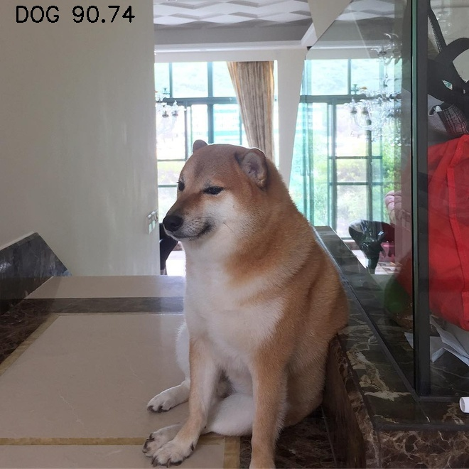
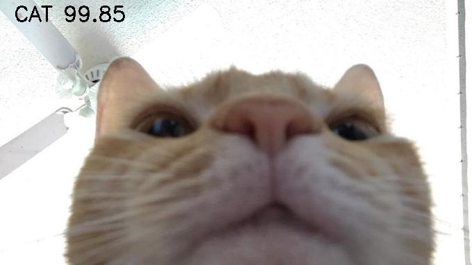

# Dog & Cat Classification with PyTorch


## Introduction 

Personal project to build deep learning model to classification images of Dogs and Cats using PyTorch.

## Training Set

The data  used for the project was taken from [Kaggle](https://www.kaggle.com/c/dogs-vs-cats), including labelled images of Dogs and Cats (12500 images each), and unlabelled ones. 

## Data Preparation

Labelled data was used to train the model, 12500 images for each categories was divided 80% as train data and 20% as test data as shown:

$\qquad$ data/ <br>
$\qquad$ $\qquad$ train/ <br>
$\qquad$ $\qquad$ $\qquad$  | -- cat (10000 images) <br>
$\qquad$ $\qquad$ $\qquad$  | -- dogs (10000 images) <br>
$\qquad$ $\qquad$ test/ <br>
$\qquad$ $\qquad$ $\qquad$  | -- cat (2500 images) <br>
$\qquad$ $\qquad$ $\qquad$  | -- dogs (2500 images) <br>

## Depedencies and Installation
- Enviroments: Python 3.10.6 + CUDA 12.0

- Required library:
    ``` bash
    pip install -r requirements.txt
    ```

## Training

To run, use this command
``` bash
python train.py
```

Hyperparameters used for this model are:

- Epoch = 10
- Learning rate = 1e-5

## Inference

To run, get the URL of the picture, insert it the code and run:
```bash
python infer.py
```

|  |  |
| --------------------------------- | ----------------------------------------- |

## TODO

- [ ] Further improve the accuracy of the model
- [ ] Try out other pretrained models


